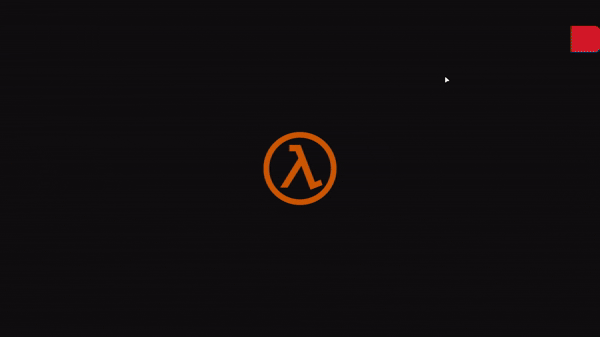
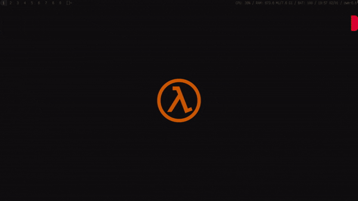
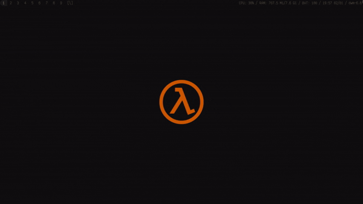

# The Divine Optimization

  

Uma documentação e guia de vastas formas nefastas de otimizar um sistema operacional.
---

<strong>Índice</strong>

- [Início](#início)
- [Sistema Operacional](#sistema-operacional)
	- [Por que não o Windows](#por-que-não-o-windows)
	- [Interfaces](#interfaces-de-wm--wc)
		- [X11 & Wayland](#protocolos-de-servidor-gr%C3%A1fico-x11--wayland)
		- [Escolher Interface](#qual-interface-escolher-afinal)
			- [DEs primárias](#des-primárias)

> Muitos elementos apresentados aqui são grandes explicações de diversos conceitos. 
> Se você já sabe o que **A** e **B** fazem, sinta-se livre para partir para o abate. 
> *Mas sempre leia as entrelinhas.*

## Início 
* Esta documentação tem como intuito guiar maneiras de tirar mais proveito do hardware a partir do software.
* Essa documentação não faz milagres. Lembre-se: mesmo com o melhor modelo de otimização, o gargalo é o hardware, não o software.
* O nome do repositório é inspirado no livro [*Divina Comédia*](https://pt.wikipedia.org/wiki/Divina_Com%C3%A9dia). Não porque esse guia é engraçado, pois você descerá aos infernos aqui.
* Este guia está em constante evolução e sujeito a alterações.

> [!TIP]
> Eu, Deive, [tenho um servidor no Discord](https://disboard.org/pt-br/server/1371434807988588636) no qual você pode pedir uma luz.

## Sistema Operacional

### Por que não o Windows
* Prepare seu coração. Essa documentação é pensada para sistemas Unix (aka Linux), esqueça o Windows.
* Windows é muito limitado quanto a modificações realmente relevantes.
* Acredite, o foco aqui não é desativar animações em uma interface ou adicionar mais swap. Aqui vamos mexer com conceitos como governadores de CPU; kernel; compilação; swap, zram, zswap; cache e mais.
* "Qual distribuição Linux eu escolho?" - Isso depende muito. Tem vários guias na internet, mas no geral escolha algo como [*Mint*](https://www.linuxmint.com/). Se seu computador rodar KDE, use [*Fedora "KDE"*](https://kde.fedoraproject.org/) *(abordaremos interfaces em seguida)*, [*CachyOS*](https://cachyos.org/) ou tanto faz. **Aqui o que eu abordar funciona para 98% das distros.**

> [!NOTE]
> Mais pra frente eu vou abordar sobre uma distro avançada chamada Gentoo. Em hipótese alguma eu a recomendo para um iniciante, ok?

### Interfaces (DE, WM & WC)
* O que é uma DE?
  * Um **D**esktop **E**nvironment é um ecossistema de ambiente desktop, contendo: Um gerenciador de janelas (WM) e aplicações próprias (seja uma taskbar ou um editor de texto)
* O que é um WM?
  * Um **W**indow **M**anager gerencia a criação, manipulação, destruição e decorações de janelas na tela do X11.
* O que é um WC?
  * Um **W**ayland **C**ompositor é o equivalente a um WM para Wayland.
> [!NOTE]
> **DEs**: *KDE Plasma; Gnome; Xfce; Cinnamon; Mate etc.*
>
> **WMs**: *I3wm; Openbox; Bspwm; DWM; Awesomewm; Kwin (Plasma X11); Mutter (Gnome X11); Xfwm (Xfce X11) etc.*
>
> **WCs**: *Hyprland; Wayfire; River; Niri; Mango; Labwc (Openbox-like); Sway (I3wm-like) etc.*

#### Protocolos de servidor gráfico (X11 & Wayland)
* O que é um protocolo de servidor gráfico?
  * Um [protocolo de servidor gráfico](https://pt.wikipedia.org/wiki/Sistema_de_janelas) é um componente de uma [interface gráfica](https://pt.wikipedia.org/wiki/Interface_gr%C3%A1fica_de_usu%C3%A1rio) que fornece suporte à implementação de [gerenciadores de janelas](#interfaces-de-wm--wc), e fornece suporte básico para o hardware gráfico, dispositivos apontadores, como mouses, e teclados.
* O que é o X11?
  * O [X](https://pt.wikipedia.org/wiki/X_Window_System)11 é um software de sistema e um [protocolo](https://pt.wikipedia.org/wiki/Sistema_de_janelas) que fornece uma base para [interfaces gráficas](interfaces-de--wm--wc) e funcionalidade rica de dispositivos de entrada para redes de computadores. Ele cria uma camada de abstração de hardware onde o software é escrito para usar um conjunto generalizado de comandos, permitindo a independência de dispositivo e reutilização de programas em qualquer computador que implemente o X.
* O que é o Wayland?
  * O [Wayland](https://pt.wikipedia.org/wiki/Wayland_(protocolo_de_servidor_gr%C3%A1fico)) é um [protocolo de servidor gráfico](#protocolos-de-servidor-gr%C3%A1fico-x11--wayland) moderno que visa substituir o [X](https://pt.wikipedia.org/wiki/X_Window_System)11. Ele foi projetado para ser mais simples, seguro e eficiente, eliminando muitas das complexidades herdadas do X. No Wayland, o compositor gerencia tudo diretamente (janelas, renderização, entrada), resultando em menos latência e melhor desempenho gráfico.

#### Qual Interface escolher afinal?
* As coisas no mundo Linux funcionam diferente em comparação ao Windows.
	* O que é uma DE pesada?
  		* Uma DE que consuma de 900 MB - 1 GB de RAM em idle e tenha muita composição (efeitos).
	* WM/WCs são pesados?
   		* Não em si. Eles são mais leves que DEs por serem *uma coisa só*. DEs são ecossistemas com diversas coisas, incluindo um WM próprio.
       	* Em um W(M,C) você é quem escolhe os aspectos do seu próprio ecossistema, misturando diversos programas até o resultado esperado. Sendo minimamente mais complexo de ser dominado quanto a uma DE, mas obviamente mais leve (se você quiser que seja).

#### DEs Primárias
* **Gnome**
	- Composições na teoria mais simples.
 	- Interface menos amigável.
  	- Pouca liberdade direta de personalização (para desativar e regular o quanto a interface puxa).
  	- Às vezes pode se mostrar mais pesado que o Plasma.
  	- [x] Wayland
  	- [x] X11
	- **Pra rodar bem teoricamente:**
  		- CPU quad core (pelo menos de segunda geração);
  	 	- 4 GB RAM ao menos;
  	  	- (I)GPU com Vulkan ao menos.

* **KDE Plasma**
	- Composições mais fantásticas, porém fáceis de serem reguladas e desativadas.
 	- Interface familiar e amigável.
    - Se mostra bem leve atualmente.
  	- [x] Wayland
  	- [x] X11
    - **Pra rodar bem teoricamente:**
  		- CPU quad core (pelo menos de segunda geração);
  	 	- CPU dual core de geração superior à oitava;
  	 	- 4 GB RAM ao menos;
  	  	- (I)GPU com Vulkan ao menos.

* **Xfce**
	- Composições simples e modulares.
 	- Interface amigável, porém humilde.
    - Sempre foi leve.
  	- [ ] Wayland (em desenvolvimento)
  	- [x] X11
	- **Pra rodar bem teoricamente:**
 		- CPU que exista; 
  	 	- 1 - 2 GB RAM ao menos;
  	  	- (I)GPU que ligue.

* **LXQt**
	- Sucessor espiritual do LXDE
	- Mais leve que Xfce em alguns casos
	- Interface básica mas funcional
	- [x] Wayland (experimental)
	- [x] X11
	- **Pra rodar bem teoricamente:**
 		- CPU que exista; 
  	 	- 1 GB RAM ao menos;
  	  	- (I)GPU que ligue.

> [!NOTE]
> Por processadores Intel terem gerações mais simples de serem medidas, foram usados como métrica. Se você usa AMD: qualquer Ryzen dá conta. Se você usa um processador AMD mais antigo, faça uma conversão.
>
> Vulkan só está como métrica para dizer respeito a GPUs dedicadas mais capazes e iGPUs minimamente dotadas (ex. Intel HD Graphics 4000). Uma GPU/iGPU sem Vulkan provavelmente aguenta o tranco também, mas aí é teste seu.

##### Tabela
| DE | RAM Idle | Complexidade | Wayland | Recomendado para |
|----|----------|--------------|---------|------------------|
| Gnome | ~900MB-1.2GB | Baixa | ✓ | Hardware médio+ |
| KDE Plasma | ~600MB-800MB | Baixa - Média | ✓ | Versátil |
| Xfce | ~300MB-500MB | Baixa | * | Hardware modesto |
| LXQt | ~250MB-400MB | Baixa | * | Hardware limitado |

#### WMs & WCs (W-I-P)
* O principal ponto de usar um WM/C é o controle. Ele em si é extremamente simples, um gerenciador de janelas. Notificações, painel, gerenciador de arquivos, buscador, gerenciador de wallpapers etc: tudo fica ao teu critério.
* Todo WM/C espera que você use bastante o teclado para diversos atalhos, alguns mais que outros.
* Todos são bastantes únicos, mas algo em comum que todos compartilham é um layout de organização de janelas. Basicamente, a forma como eles dispoem janelas pelo monitor.
* Os layouts mais comuns são: Stacking, Tiling e Dwindle. Eu explorarei um por um, demonstrarei cada um e direi quais WM/Cs usam X e Y.

<strong>Stacking</strong>

  

- A
- B
- C

<strong>Tiling</strong>

  

- A
- B
- C

<strong>Dwindle</strong>

  

- A
- B
- C
  

<!-- Abaixo, pra depois, colocar mais um menu flutuante chamado "Others" para por o scrollable e spiral layout. -->

# Fontes
<!-- Essa categoria é sempre no final, são os créditos. -->
- [Wikipedia](https://pt.wikipedia.org/)
- [Gentoo Wiki](https://wiki.gentoo.org/wiki/Main_Page)
