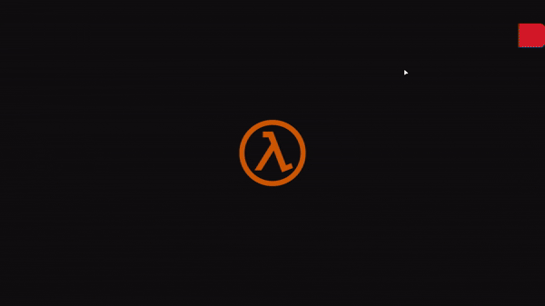
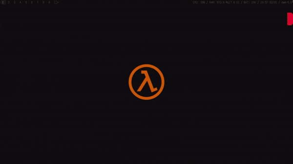
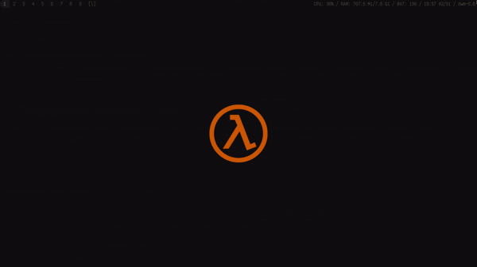
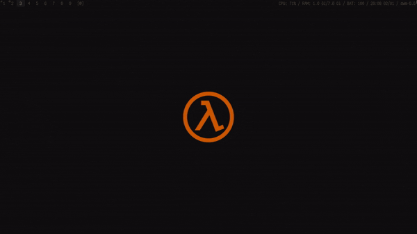
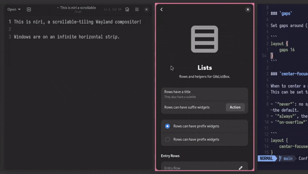
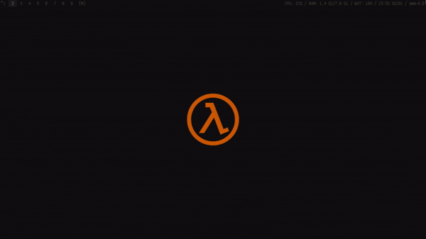

# 🪟 Interfaces

> [← Voltar ao índice](../README.md)

Esta seção cobre ambientes gráficos: o que são, como se diferenciam e qual escolher com base no seu hardware.

---

## Índice

- [Conceitos: DE, WM e WC](#conceitos-de-wm-e-wc)
- [Protocolos gráficos: X11 e Wayland](#protocolos-gráficos-x11-e-wayland)
- [Qual interface escolher?](#qual-interface-escolher)
  - [DEs Primárias](#des-primárias)
  - [WMs e WCs](#wms-e-wcs)
    - [Layouts de janelas](#layouts-de-janelas)

---

## Conceitos: DE, WM e WC

* **DE (Desktop Environment):** Um ecossistema de ambiente desktop completo, contendo um gerenciador de janelas e aplicações próprias (barra de tarefas, editor de texto etc.).
* **WM (Window Manager):** Gerencia a criação, manipulação, destruição e decorações de janelas no X11.
* **WC (Wayland Compositor):** O equivalente ao WM para Wayland.

> [!NOTE]
> **DEs:** KDE Plasma, Gnome, Xfce, Cinnamon, Mate...
>
> **WMs:** i3wm, Openbox, bspwm, DWM, Awesomewm, Kwin (Plasma X11), Mutter (Gnome X11), Xfwm (Xfce X11)...
>
> **WCs:** Hyprland, Wayfire, River, Niri, MangoWC, Labwc (Openbox-like), Sway (i3wm-like)...

---

## Protocolos gráficos: X11 e Wayland

* **O que é um protocolo de servidor gráfico?**
  Um [protocolo de servidor gráfico](https://pt.wikipedia.org/wiki/Sistema_de_janelas) é um componente de uma [interface gráfica](https://pt.wikipedia.org/wiki/Interface_gr%C3%A1fica_de_usu%C3%A1rio) que fornece suporte à implementação de [gerenciadores de janelas](#interfaces-de-wm--wc), e fornece suporte básico para o hardware gráfico, dispositivos apontadores, como mouses, e teclados.
  
* **X11:** O [X](https://pt.wikipedia.org/wiki/X_Window_System)11 é um software de sistema e um [protocolo](https://pt.wikipedia.org/wiki/Sistema_de_janelas) que fornece uma base para [interfaces gráficas](interfaces-de--wm--wc) e funcionalidade rica de dispositivos de entrada para redes de computadores. Ele cria uma camada de abstração de hardware onde o software é escrito para usar um conjunto generalizado de comandos, permitindo a independência de dispositivo e reutilização de programas em qualquer computador que implemente o X.

* **Wayland:** O [Wayland](https://pt.wikipedia.org/wiki/Wayland_(protocolo_de_servidor_gr%C3%A1fico)) é um [protocolo de servidor gráfico](#protocolos-de-servidor-gr%C3%A1fico-x11--wayland) moderno que visa substituir o [X](https://pt.wikipedia.org/wiki/X_Window_System)11. Ele foi projetado para ser mais simples, seguro e eficiente, eliminando muitas das complexidades herdadas do X. No Wayland, o compositor gerencia tudo diretamente (janelas, renderização, entrada), resultando em menos latência e melhor desempenho gráfico.

---

## Qual interface escolher?

### O que define "pesado"?

* **DE pesada:** Consome 900 MB – 1 GB de RAM em idle e possui muitos efeitos de composição.
* **WM/WC:** Mais leves que DEs por serem *uma coisa só*. Você monta o ecossistema escolhendo cada componente manualmente, mais flexível, porém com curva de aprendizado maior.

---

## DEs Primárias

### Gnome
- Composições simples na teoria.
- Interface menos amigável e com pouca liberdade direta de personalização.
- Pode se mostrar mais pesado que o Plasma.
- ✅ Wayland | ✅ X11
- **Requisitos mínimos sugeridos:** CPU quad-core (2ª geração+), 4 GB RAM, iGPU/GPU com Vulkan.

### KDE Plasma
- Composições ricas, fáceis de regular e desativar.
- Interface familiar e amigável. Atualmente bastante leve.
- ✅ Wayland | ✅ X11
- **Requisitos mínimos sugeridos:** CPU quad-core (2ª gen+) ou dual-core acima da 8ª geração Intel, 4 GB RAM, iGPU/GPU com Vulkan.

### Xfce
- Composições simples e modulares. Sempre foi leve.
- Interface funcional e amigável.
- ⏳ Wayland (em desenvolvimento) | ✅ X11
- **Requisitos mínimos sugeridos:** Qualquer CPU, 1–2 GB RAM, qualquer GPU que ligue.

### LXQt
- Sucessor do LXDE. Mais leve que o Xfce em alguns casos.
- Interface básica mas funcional.
- 🧪 Wayland (experimental) | ✅ X11
- **Requisitos mínimos sugeridos:** Qualquer CPU, 1 GB RAM, qualquer GPU que ligue.

> [!NOTE]
> Intel foi usado como referência de gerações por ter convenção mais simples. Para AMD: qualquer Ryzen dá conta. Para AMD mais antigo, faça uma conversão equivalente.
>
> Vulkan está como métrica para indicar GPUs/iGPUs minimamente capazes (ex.: Intel HD Graphics 4000+). Sem Vulkan pode funcionar, mas é teste seu.

### Tabela comparativa

| DE | RAM Idle | Wayland | Recomendado para |
|----|----------|---------|------------------|
| Gnome | ~900 MB–1,2 GB | ✅ | Hardware médio+ |
| KDE Plasma | ~600 MB–800 MB | ✅ | Versátil |
| Xfce | ~300 MB–500 MB | ⏳ | Hardware modesto |
| LXQt | ~250 MB–400 MB | 🧪 | Hardware limitado |

---

## WMs e WCs

O principal ponto de usar um WM/WC é o controle dedo a dedo sobre o ambiente. Notificações, painel, gerenciador de arquivos, launcher, wallpaper: tudo fica ao seu critério.

* Todo WM/WC espera uso intenso do teclado para atalhos.
* O que todos compartilham é um **layout de organização de janelas**.

### Layouts de janelas

<strong>Stacking</strong>

  

- **O que é:** Janelas flutuantes que se sobrepõem, como no Windows/macOS tradicional.
- **Comportamento:** Posicionamento e redimensionamento manuais. A janela focada fica "no topo".
- **Ideal para:** Quem vem do Windows e não quer mudar o paradigma de uso.
- **WMs:** Openbox, Fluxbox, IceWM, JWM
- **WCs:** Labwc, Hikari, Wayfire
- **Curva de aprendizado:** Baixa

<strong>Tiling</strong>

  

- **O que é:** Janelas preenchem a tela automaticamente sem sobreposição, como ladrilhos.
- **Comportamento:** Cada nova janela divide o espaço disponível. Layout geralmente master-stack.
- **Ideal para:** Produtividade, uso via teclado, múltiplos terminais, editores de código.
- **WMs:** i3wm, bspwm, qtile, awesome
- **WCs:** Sway, River
- **Curva de aprendizado:** Média-Alta

<strong>Dwindle</strong>

  

- **O que é:** Variação de tiling onde cada nova janela divide a anterior em espiral.
- **Comportamento:** Primeira janela ocupa tudo. Segunda divide em 50/50. Terceira divide a metade em 50/50, criando o padrão espiral.
- **Ideal para:** Tiling com foco visual na janela principal. Bom para navegador + terminal + editor.
- **WMs:** DWM (com patches), Awesome
- **WCs:** Hyprland, MangoWC
- **Curva de aprendizado:** Média

<strong>Outros layouts</strong>

  
  

  

**Spiral:** Similar ao dwindle, mas com proporções diferentes. Usado em: Awesome, XMonad, DWM.

**Scrollable:** Janelas organizadas horizontalmente como uma fila: você scrolla entre elas. Ideal para monitores pequenos: janelas são empurradas, não cortadas. Usado em: Niri, MangoWC.

**Monocle:** Uma janela por vez em tela cheia. Útil para foco total em uma tarefa. Disponível em quase todos os WM/WCs via toggle ou dedicado.

> [!TIP]
> Vários WM/WCs suportam múltiplos layouts:
>
> Ex.: XMonad, DWM (via [patches](https://dwm.suckless.org/patches/)), Wayfire ([simple-tile](https://github.com/DavySD/wm-dotfiles) opcional), Sway (tabs e stacking opcionais), MangoWC ([mais de 9 layouts](https://mangowc.vercel.app/)).
